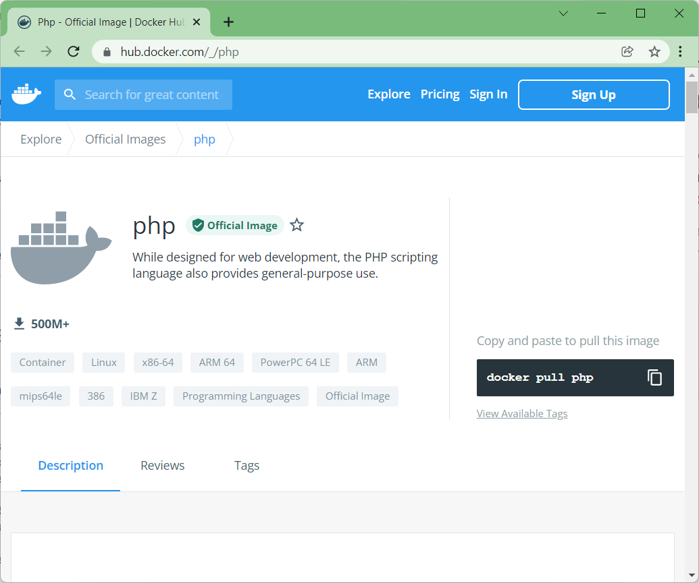
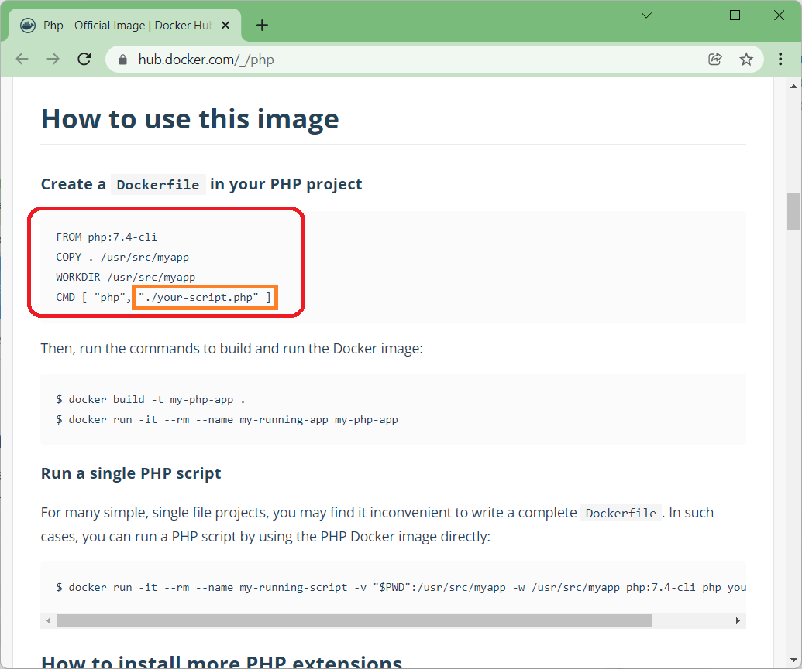
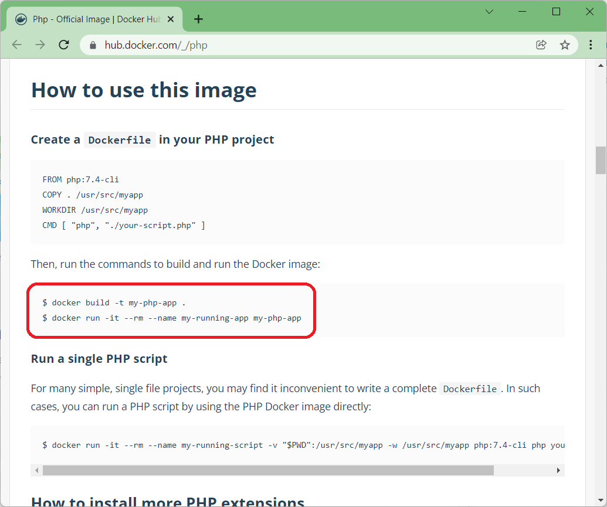
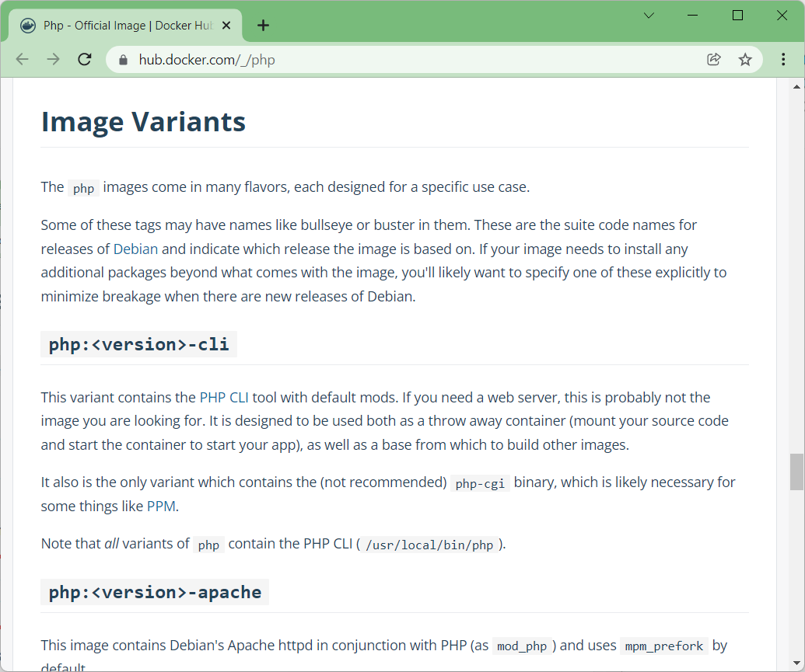
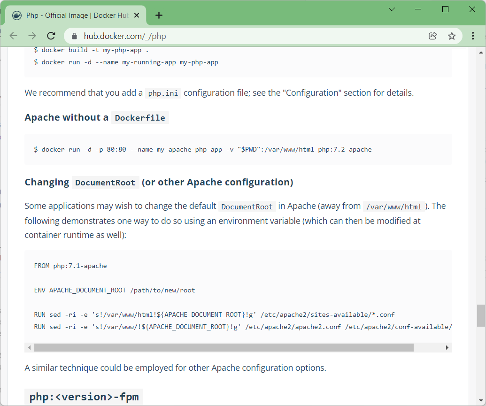

# Configuració d'un entorn bàsic de desenvolupament **PHP** local a **Docker**.

[enllaç](https://dev.to/truthseekers/setup-a-basic-local-php-development-environment-in-docker-kod)

En aquest repositori intntaré mostrat com configurar un entorn de desenvolupament **PHP** local bàsic a Docker. Per aconseguir-ho farem servir **```docker-compose```** i **```Dockerfile```**. Farem servir **PHP**, **Apache** i **Mysql**.

Per tenir tots el fitxers ordenats, crearem i ens desplaçarem a la carpeta **```php-docker```**.

```bash
~$ mkdir php-docker
~$ cd php-docker
~/php-docker$ cd php-docker
```

## Requisits previs: Docker i Docker-compose instal·lats.

<br>

# **Primer pas**: obtenir un script **PHP** senzill per executar-lo amb **Dockerfile**.

Si mireu la documentació de PHP Docker (***[PHP Docker docs](https://hub.docker.com/_/php)***) no veureu res sobre un fitxer **```docker-compose```**.



Però podem esbrinar com fer-ho amb el que ens donen.




Al principi ens ofereixen una configuració senzilla de **```Dockerfile```**. 

Utilitzarem el següent **```Dockerfile```** a l'arrel del directori del nostre projecte: anomeno el meu projecte "**```php-docker```**". A continuació, feu un **```Dockerfile```** amb aquest codi:

> Contingut del fitxer **```Dockerfile```**:
> 
> ```docker
> FROM php:7.4-cli
> COPY . /usr/src/myapp
> WORKDIR /usr/src/myapp
> CMD [ "php", "./index.php" ]
> ```
> &nbsp;

Si no voleu fer servir cap editor podeu executar els següent codi:
```bash
~/php-docker$ echo FROM php:7.4-cli > Dockerfile
~/php-docker$ echo COPY . /usr/src/myapp >> Dockerfile
~/php-docker$ echo WORKDIR /usr/src/myapp >> Dockerfile
~/php-docker$ echo CMD [ "php", "./index.php" ]  >> Dockerfile
```

Per validar que el contingut del fitxer **```Dockerfile```** és correcte, podeu executar:
```bash
~/php-docker$ cat Dockerfile
FROM php:7.4-cli
COPY . /usr/src/myapp
WORKDIR /usr/src/myapp
CMD [ php, ./index.php ]
~/php-docker$ 
```

Aquest codi és la configuració per crear la imatge que farem servir. Aquesta configuració incorpora **PHP 7.4** amb algunes coses de la línia d'ordres.

Els **```COPY . /usr/src/myappcopia```** el contingut de directori actual a **```/usr/src/miapp```** dins el contenidor de **```Docker```**. La següent línia: **```WORKDIR /usr/src/myapp```** estableix el **```/usr/src/myapp```** com el "***directori de treball***", com ho faríeu per **```cd /to/your/project```**.

A continuació, des de la carpeta **```/usr/src/myapp```** executem l'ordre **```$ php ./index.php```** on **```index.php```** és el nostre **script**. Això vol dir que necessitem un script PHP. Creem el nostre **```index.php```** fitxer dins del directori del projecte així:

> Contingut del fitxer **```index.php```**:
> 
> 
> ```php
> <?php
> 
> echo "Hola des del contenidor de docker!";
> ```

Si no voleu fer servir cap editor podeu executar els següent codi:
```bash
~/php-docker$ echo \<?php > index.php
~/php-docker$ echo "" >> index.php
~/php-docker$ echo echo \"Hola des del contenidor de docker\"\; >> index.php
```

Per validar que el contingut del fitxer **```index.php```** és correcte, podeu executar:
```bash
~/php-docker$ cat index.php
<?php

echo "Hola des del contenidor de docker";
~/php-docker$ 
```

Tornant a la documentació de PHP Docker (***[PHP Docker docs](https://hub.docker.com/_/php)***), podem continuar amb les instruccions per crear i executar la imatge de **Docker**:




```bash
$ docker build -t my-php-app .
```

* La primera ordre construirà una imatge amb el nom **```my-php-app```** al vostre ordinador utilitzant el contingut del directori actual.

```bash
$ docker run -it --rm --name my-running-app my-php-app
```

* La segona comanda prepara un contenidor anomenat **```my-running-app```** basat en la imatge que acabem de crear "**```my-php-app```**". I l'hem adaptat per executi el nostre script **```index.php```**, de manera que el nostre **script** s'executa a la línia d'ordres.

> ## Primer pas complert!

<br>

# **Segon pas**: obtenir un script **PHP** senzill per executar-lo amb **Dockerfile**.


Però els scripts **PHP** senzills no són gaire útils. Ara passarem a configurar-ho en un servidor web **Apache**.

Si us desplaceu més avall per la **documentació de PHP Docker** (***[PHP Docker docs](https://hub.docker.com/_/php)***), veureu una secció "**Image Variants**" amb una d'elles **```php-apache```**.



Aquesta imatge inclou **Apache** amb **PHP**. Això ens permetrà executar fàcilment el nostre **script** en un servidor web i mostrar els resultats de l'**script** en un navegador.


De nou, seguim les indicacions a la secció **Apache without a Dockerfile**. Per **executar la imatge *Apache/php* SENSE un fitxer *docker***, executeu aquesta ordre:




La comanda és la següent:
```bash
docker run -d -p 80:80 --name my-apache-php-app -v "$PWD":/var/www/html php:7.2-apache
```

Aquesta línia bàsicament executa:
* **```RUN```** executa el contenidor,
* **```--name my-apache-php-app```** canvia el nom a **```my-apache-php-app```**
* **``-p 80:80``** és per canviar el mapeig del PORT des de la nostra màquina local fins al port del contenidor. El costat esquerre és el nostre port local, el costat dret és el port del contenidor.
* **```-v```** per establir el **```VOLUM```**, bàsicament, enllaça el nostre directori de treball actual a la carpeta **```/var/www/html```**. Això bàsicament posa el contingut del nostre directori actual al directori del contenidor (**```/var/www/html```**) perquè el nostre codi s'executi dins d'ell. 
* **```php:7.2-apache```** defineix la imatge a partir de la qual construïm, que és **```php:7.2-apache```**.

D'acord, hem configurat perquè el nostre **script** s'executi al port `**```80```**`, així que seguiu endavant i visiteu:
```
http://localhost:80
```
i hauríeu de veure el vostre script s'executa al navegador.


